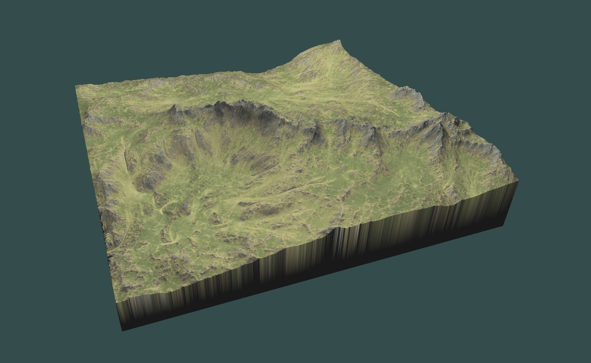

# Terrain Viewer

- Loads heightmaps from PGM file format in to a mesh
- Loads diffuse map

## Version 0.1 load times

### 1025x1025 terrain size
Read from heightmap in PGM file: 4s

Generate vertices and indices: 3s

Generate normals: 5s

Generate VBO/VAO: 425ms

Read from diffuse map: 421ms

### Current Process
The mesh and indices are generated by iterating over each greyscale image on the 16 bit PGM file. This is a slow process and needs to be improved. Currently looking in to TRIANGLE_STRIPS and degenerate triangles to improve load performance. Although once loaded both the 1k and 2k terrain sizes run at an average of 17ms or 60fps.

## Current version

